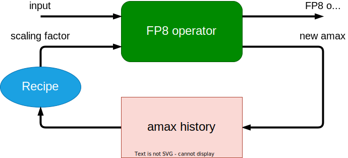
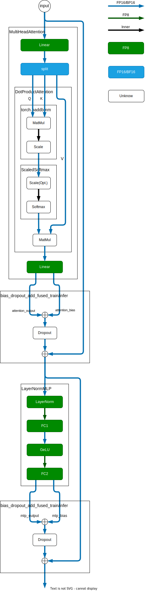

# FP8

## 原理介绍

NVIDIA [官方介绍](https://docs.nvidia.com/deeplearning/transformer-engine/user-guide/examples/fp8_primer.html#Introduction-to-FP8)

## 源码分析

### 环境要求

根据 TransformerEngine [源码](https://github.com/NVIDIA/TransformerEngine/blob/main/transformer_engine/pytorch/fp8.py#L39)可知，TransformerEngine 的软硬件要求为：

1. Device compute capability > 9.0
2. Device compute capability == 8.9 && CublasLt version >= 12.1.3.x && Cuda version >= 12.1

```python
def _check_fp8_support() -> Tuple[bool, str]:
    """Return if fp8 support is available"""
    if get_device_compute_capability() >= 9.0: # hopper and above
        return True, ""
    if get_device_compute_capability() < 8.9: # pre-ada
        return False, "Device compute capability 8.9 or higher required for FP8 execution."
    if tex.get_cublasLt_version() < 120103:
        return False, "CublasLt version 12.1.3.x or higher required for FP8 execution on Ada."
    if float(torch.version.cuda) < 12.1:
        return False, "Cuda version 12.1 or higher required for FP8 execution on Ada."
    return True, ""
```

查看[官方文档](https://developer.nvidia.com/cuda-gpus)可知，目前支持的 GPU 型号为（更新于2023年4月21日）：

* NVIDIA H100
* NVIDIA L4
* NVIDIA L40
* RTX 6000
* GeForce RTX 4090
* GeForce RTX 4080
* GeForce RTX 4070 Ti
* GeForce RTX 4060
* GeForce RTX 4050

抽查了前 4 款 GPU 都包含 FP8 硬件运算单元。








