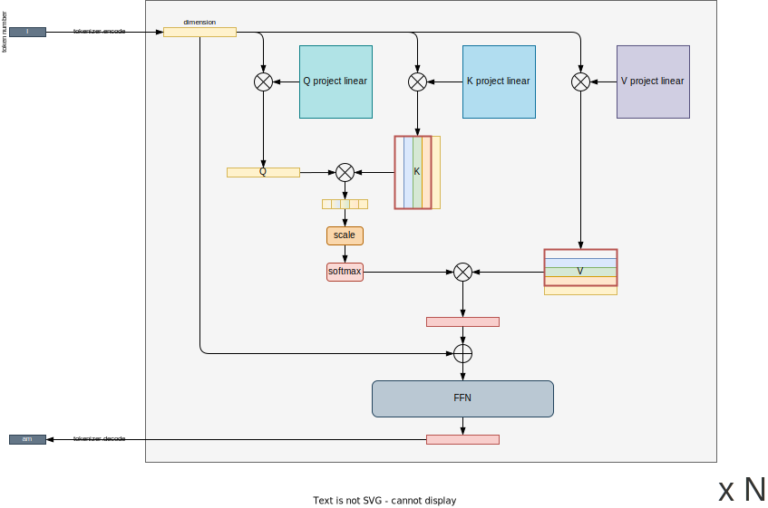

# KV cache

## 结论

1. 应用在什么地方?
    a. 优化基于 decoder 结构的 LM(i.e., Language Model) 模型中 attention 和 FFN 的推理效率
2. 暂存了什么内容?
    a. 历史 token 对应的 K/V tensor
3. 节省了什么时间?
    a. 计算历史 token 对应的 K/V tensor 的时间
    b. 计算历史 token 对应的 FFN 的时间
4. 能够工作的前提条件(注意点)
    a. 当前 token 只能看到历史 token 信息不能看到未来 token 信息
    b. 计算 attention 时, scale 系数是常数(e.g., $\sqrt{d_k}$ 其中 $d_k$ 是 Q/K 的特征维度, 模型完成设计即确定, 注意不是 token 数量)

## 背景

KV cache 的优化发生在 decoder-only 的 Causal LM 结构中(代表模型是 GPT, Generative Pre-Training 系列), 其结构示意可参考下图:

在实际推理过程中,

1. $x_1, x_2, x_3$ 作为输入文本进入模型
2. 模型经推理输出预测结果 $y_1$
3. 随后 $y_1$ 拼接到 $x_1, x_2, x_3$ 后面作为模型新的输入文本, 以此往复, 直到输出 "休止符"

模型结构上需要注意的点是: 当前 token 只能看到历史 token 信息.

## 推演优化流程

> 推演优化流程主要通过图示说明 KV cache 如何实现和优化点.

### 第一帧

第一帧文本数据通常是用户输入的一个问句, e.g., 用户输入 "who are you?", 经过推理得到输出文本的第一个词 "I". 具体请参考下图所示:

### 第二帧

#### without KV cache

#### with KV cache

图中红色矩形框中的 tensor 表示在 cache 中.

